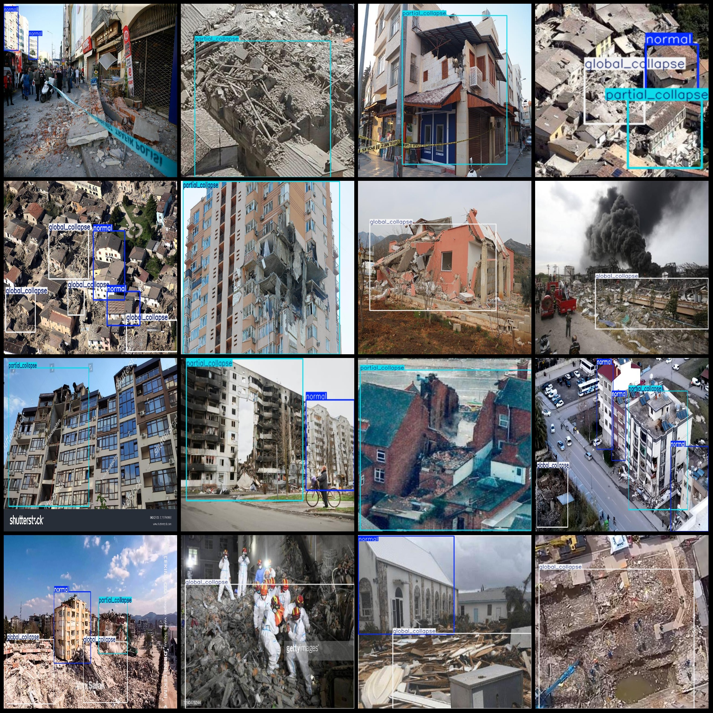
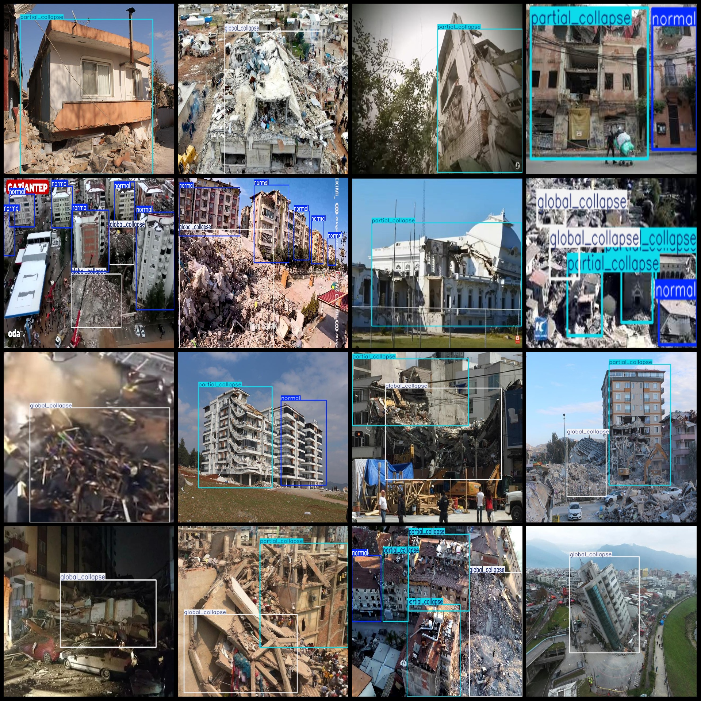

# Building Dataset for Destruction Depth and Damage Detection: VOC+YOLO Format with 3268 Images, 3 Categories

Dataset format: Pascal VOC format + YOLO format (txt files without split paths, only containing jpg images along with corresponding VOC format xml files and YOLO format txt files)
Number of images (jpg file count): 3268
Number of annotations (xml file count): 3268
Number of annotations (txt file count): 3268
Number of annotation categories: 3
Annotation category names in yolo format (not consistent with this list, according to the labels folder's classes.txt): ["global_collapse", "normal", "partial_collapse"]
Box counts per category:
- global_collapse boxes = 2668
- normal boxes = 3388
- partial_collapse boxes = 2209
Total box count: 8265
Number of images per category:
- global_collapse (all collapses) = 1593
- normal (no collapses) = 1269
- partial_collapse (partial collapses) = 1834
Image resolution: 640x640
Annotation tool used: labelImg
Annotation rules: Drawing bounding boxes for categories
Important note: The dataset does not have division into training validation test sets; users are required to divide it themselves.
Special declaration: This dataset does not guarantee the accuracy of models trained or weight files created.
Image preview:
Annotation example:

Image

Here is a pay link on Stripe ( https://buy.stripe.com/3cs8yP7sY87d0vu9AB ). Please contact me lonlonago@foxmail.com after funding $89, and I will send you a complete data files , thank you!

